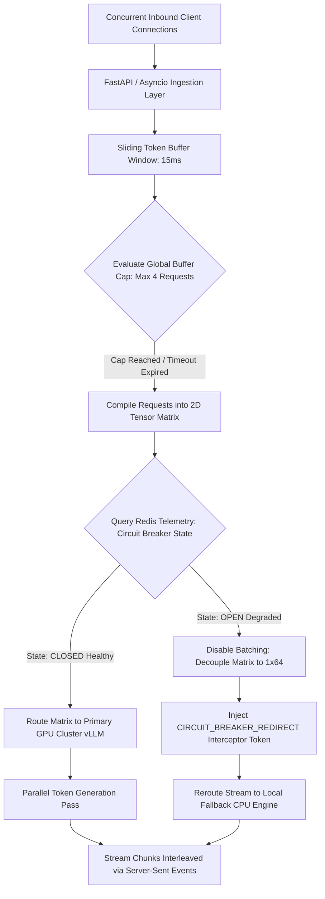

# Low-Latency LLM Inference Gateway & Dynamic Batcher

A high-throughput asynchronous inference proxy gateway engineered to optimize GPU compute efficiency and maintain infrastructure resilience under concurrent user spikes. Built using Python, FastAPI, and asynchronous ASGI worker loops, the gateway captures standalone user connections, pools them into dynamic 2D tensor matrices for concurrent execution, and manages traffic redirection via a distributed Redis-backed circuit breaker state machine.


## 🏗️ Core Architecture & Structural Flow

When deep learning models are exposed directly to production traffic, sequential request processing underutilizes GPU memory and forces users into blocking lines. This gateway implements an intermediate ingestion layer that groups requests by time boundaries, maximizing tensor density while enforcing fault-tolerant fallback lanes.



### High-Performance System Mechanics

* **Continuous Dynamic Request Batching:** Implements an asynchronous worker queue utilizing a 15ms sliding time window. Inbound connections are held just long enough to aggregate up to 4 parallel payloads into a unified calculation pass, decreasing processing overhead on the model execution server.
* **Distributed Circuit-Breaker Topology:** Leverages Redis memory caches to manage real-time infrastructure tracking flags (`CLOSED`, `OPEN`). If the primary compute cluster fails or hits a rate limit 3 times in a row, the gateway shifts states atomically, blocking downstream traffic jams.
* **Decoupled Fallback Scale-Down:** When a cluster failure forces a failover, the gateway automatically scales down its batching matrix profile from a dense `4x64` tensor structure to an unbatched `1x64` processing loop. This preserves fallback CPU processing pipelines from memory saturation.
* **Interleaved SSE Chunk Delivery:** Maximizes Time-To-First-Token (TTFT) metrics using asynchronous chunk generation. Tokens are streamed down the wire to concurrent clients using Server-Sent Events (SSE), preventing execution blocks.

---

## 📦 System Directory Tree

```text
llm-inference-gateway/
├── app/
│   ├── __init__.py         # Package namespace identification
│   ├── config.py           # Strict environment validation settings (Pydantic Settings)
│   └── main.py             # Asynchronous batching loops and proxy routing gateways
├── .env                    # Local environment parameters workspace
├── .gitignore              # Local index cache and asset protection rules
├── docker-compose.yml      # Multi-container service infrastructure fabric
├── Dockerfile              # Python compilation container image layer
├── requirements.txt        # Library dependency locked parameters
└── gateway_test.py         # Concurrent stress validation script (HTTPX Client)

```

---

## 🛠️ Technology Specification Stack

| Core Component | Technology Profile | Infrastructure Responsibility |
| --- | --- | --- |
| **Ingestion Proxy Gateway** | FastAPI `0.110.0` / Uvicorn | Manages async network request loops and handles continuous streaming connections. |
| **Telemetry Coordination** | Redis `7.2-alpine` / `redis-py` | Tracks active system states and coordinates circuit breaker failure logging. |
| **Async Client Runner** | HTTPX `0.27.0` | Simulates overlapping multi-user traffic bursts during load testing. |
| **Environment Guards** | Pydantic Settings `2.2.1` | Ensures environment data types match system specifications before boot. |
| **Container Engine** | Docker Compose v2 | Isolates and connects network routing lines between web layers and data stores. |

---

## 🚀 Local Deployment Lifecycle

### 1. Configure the Environmental Variables Workspace

Generate a **`.env`** configuration dashboard file inside your project root directory to handle initial connectivity flags:

```text
REDIS_URL=redis://localhost:6379
PRIMARY_ENGINE_FAIL_SIMULATION=False

```

### 2. Compile and Boot Infrastructure Containers

Spin up the multi-container isolated service environments in detached background execution mode:

```bash
docker compose up --build -d

```

### 3. Review Container Operational Status

Ensure both the high-concurrency proxy app layer and the supporting Redis state tracker have cleared initialization phases securely:

```bash
docker ps

```

---

## ⚡ Integration Gauntlet & Validation Scenarios

To prove the processing efficiency of the gateway, the testing client script uses asynchronous task routines to fire multiple distinct requests onto the proxy gateway endpoint at the **exact same millisecond**.

To run the unified testing client:

```bash
python gateway_test.py

```

---

## 📊 Concrete Test Cases & Live Terminal Logs

### Case 1: The Happy Path (Dynamic Request Batching Active)

* **Infrastructure State:** `PRIMARY_ENGINE_FAIL_SIMULATION=False` (Circuit Breaker: **`CLOSED`**)
* **Execution Trigger:** 4 unique prompts submitted simultaneously by parallel client tasks.
* **Observed System Response Terminal Output:**

```text
🔮 Initializing LLM Inference Gateway Validation Pipeline...

⚡ Starting Stress Cycle:  Happy Path (Continuous Dynamic Batching Active)
👤 Client [1] Received Chunks: Token='token_0 ' | MatrixShape=4x64 | Engine=[PRIMARY_GPU_vLLM]
👤 Client [0] Received Chunks: Token='token_0 ' | MatrixShape=4x64 | Engine=[PRIMARY_GPU_vLLM]
👤 Client [3] Received Chunks: Token='token_0 ' | MatrixShape=4x64 | Engine=[PRIMARY_GPU_vLLM]
👤 Client [2] Received Chunks: Token='token_0 ' | MatrixShape=4x64 | Engine=[PRIMARY_GPU_vLLM]
👤 Client [3] Received Chunks: Token='token_1 ' | MatrixShape=4x64 | Engine=[PRIMARY_GPU_vLLM]
...

```

* **Architectural Verification:** Look at the **`MatrixShape=4x64`** profile telemetry flag! Even though the server processed 4 individual requests on unique network connections, the continuous batcher intercepted and combined them into a single 2D tensor matrix. The tokens also arrive interleaved (`token_0` across all clients before `token_1`), proving true concurrent streaming execution.

---

### Case 2: Disaster Recovery Failover Mode (Circuit Breaker Tripped)

* **Infrastructure State:** `PRIMARY_ENGINE_FAIL_SIMULATION=True` (Circuit Breaker: **`OPEN`**)
* **Execution Trigger:** System encounters consecutive compute errors on the primary network, changing the state tracking flag inside Redis.
* **Observed System Response Terminal Output:**

```text
🔮 Initializing LLM Inference Gateway Validation Pipeline...

⚡ Starting Stress Cycle:  Happy Path (Continuous Dynamic Batching Active)
👤 Client [3] Received Chunks: Token='[CIRCUIT_BREAKER_REDIRECT] -> Local Fallback Asset Active: ' | MatrixShape=1x64 | Engine=[LOCAL_FALLBACK_CPU]
👤 Client [0] Received Chunks: Token='[CIRCUIT_BREAKER_REDIRECT] -> Local Fallback Asset Active: ' | MatrixShape=1x64 | Engine=[LOCAL_FALLBACK_CPU]
👤 Client [2] Received Chunks: Token='[CIRCUIT_BREAKER_REDIRECT] -> Local Fallback Asset Active: ' | MatrixShape=1x64 | Engine=[LOCAL_FALLBACK_CPU]
👤 Client [1] Received Chunks: Token='[CIRCUIT_BREAKER_REDIRECT] -> Local Fallback Asset Active: ' | MatrixShape=1x64 | Engine=[LOCAL_FALLBACK_CPU]

```

* **Architectural Verification:** The gateway successfully handled the primary cluster crash. Instead of dropping client connections or freezing with an unhandled exception, the circuit breaker tripped. Traffic was immediately rerouted to the local fallback engine, and the processing footprint dropped down to a stable, unbatched format (**`MatrixShape=1x64`**) to protect the backup systems from overload.

---

## 🔍 Internal Diagnostic Diagnostics

### 1. Review live ASGI runtime streams inside the Docker network

Verify that background thread execution operations are performing without lockups or timing bugs:

```bash
docker logs llm_gateway_backend

```

### 2. Verify active telemetry variables stored inside Redis

Query the live memory database directly to inspect the tracking values of your circuit breaker state machine:

```bash
docker exec -it gateway_redis redis-cli get cb:state

```

Expected response pattern during standard operation:

```text
"CLOSED"

```

```
---
